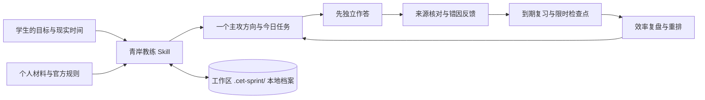

# 青岸计划·四六级英语考试冲刺教练

> **把“我今天该学什么”变成有依据、能开始、可检验的一步。**
>
> *Emerald Shore Initiative · CET Sprint Coach*

[](https://github.com/XiaoSiKe/cet-sprint-coach/actions/workflows/ci.yml)


这是一个以对话为入口、以本地学习记录为事实源的 **CET-4 / CET-6 笔试 Skill**。学生可以直接说目标、上传自己的材料、作答或描述卡点；教练在后台调用本地引擎，把训练结果变成下一次计划。项目不打包历年真题，不承诺分数，也不把它做成要求学生学习命令的独立 App。

## 先看它如何工作



每次对话尽量收束到 **当前依据 → 下一动作 → 完成证据**。没有可信基线就先诊断；正在做题时一次只给一题；做错后找首个决定性缺口，再用新题复测。

### 可以这样开始

```text
用 $cet-sprint-coach 帮我准备四级。我每天只有 45 分钟，还没做过模考。
用 $cet-sprint-coach 看我这周的听力和阅读记录，今天先练什么？
用 $cet-sprint-coach 批改这篇六级作文，先指出最影响表达的一处。
用 $cet-sprint-coach 看我最近为什么很忙却没进步。
```

首次只补问会改变当前动作的信息，不让学生先填长问卷。级别是建档必需项；考试日期、目标分和最近成绩可以随后补充。

## 系统全景

| 系统 | 负责什么 | 关键边界 |
|---|---|---|
| **现实诊断与阶段规划** | 记录四/六级、考试日期、课表可用时间、来源题与限时基线；每周确定一个主攻 | 样本少时只叫“暂定主攻”，不算精确提分概率 |
| **每日任务与容量** | 最多三项关键任务，按真实可用时间留 15% 缓冲 | 不用熬夜补齐失真的计划；只看材料不算完成 |
| **材料与来源** | 索引个人 PDF、DOCX、文本和音频；保留哈希、年份、位置与置信度 | 原件只读；文件名不证明“官方”或“真题” |
| **逐题训练与原创题核验** | 一次一题、先答后讲；检查四选项、答案及可定位引文 | 程序只能筛掉明显错误，语义歧义仍需审读；无法确认就标 `unverified` |
| **词汇到期复习** | 直接调用锁定版本的 Py-FSRS；到期题可按 ID 精确取出 | 依赖缺失时标明固定间隔降级；考前复习上限优先 |
| **检查点与成绩** | 分开保存模考原始正确数、用时与官方报道分 | 不把正确率线性换算成 710 分；写作和翻译的官方报道分合并 |
| **效率与自我调节** | 分别看执行、有效证据、独立作答、错因复发和检查点；只给一个优先改动 | 不造“综合效率分”，不把学习时长当成能力 |
| **情绪与启动支持** | 任务过重时降阶，使用具体情境—动作计划，反馈可观察的进步 | 不羞辱、不保证通过；危机时停止学习督促 |

这些系统借鉴了[青岸考研教练](https://github.com/XiaoSiKe/emerald-shore-postgraduate-exam-coach)的证据闭环，但按四六级笔试重新设计了题型、听力音频、写译反馈和成绩边界。学习方法见[学习科学](references/learning-science.md)，决策方法见[哲学与冲刺策略](references/strategy-methods.md)，效率诊断见[效率系统](references/efficiency-evaluation.md)。

## 一次真实训练会经历什么

1. **调查**：先看档案、日期、现实容量和最近同型练习；没有成绩可先做短时诊断。
2. **选主攻**：在听力、阅读、写作或翻译中只选一个本周重点，其他模块保留短时维持。
3. **独立输出**：`drill` 给一题，听力先放音频，阅读先让学生定位，写译先收作品；答案与脚本在作答前隐藏。
4. **反馈与复测**：先指出证据和首个错因，补最短解释，再用不同题目检验能否迁移。
5. **到期复习**：`review` 列出到期 ID，`drill --item-id` 精确取题；词汇可用 FSRS 安排下次提取。
6. **周复盘**：`report` 给原始记录，`efficiency` 给多维诊断；学生先解释数据，再调整下周一项策略。

连续失败时缩小步长，暂停机械加题。若现实时间、模考结果或官方日期改变，就重排，而不是让旧计划继续压着学生。

## 为什么不直接给“预测分”

[中国教育考试网的笔试结构](https://cet.neea.edu.cn/html1/folder/16113/1586-1.htm)显示，四级和六级的听力子题型与时长不同；听力、阅读、写作、翻译的卷面比例分别为 35%、35%、15%、15%。[官方分数解释](https://cet.neea.edu.cn/xhtml1/folder/19081/5124-1.htm)明确采用常模参照、总分 710，**不设及格线**；官方单项报道为听力 249、阅读 249、写作与翻译合并 212。

所以项目只做这些可核验的事：记录“某题型做对 6/10、用了 35 分钟”、比较条件相近的检查点、标出重复错因。模型批改作文或翻译只能作为**非官方教练反馈**。用户或学校可以设 425 等个人目标，但不能称它为官方及格线。当年的考试日期、报名和准考证以[官方动态](https://cet.neea.edu.cn/xhtml1/category/16093/1124-1.htm)与学校通知为准；参考页见[官方规则](references/official-rules.md)。

## 安装与使用

要求 Python 3.12+ 和 [`uv`](https://docs.astral.sh/uv/)。新安装时把仓库放入 Codex 的 Skill 目录：

```bash
git clone https://github.com/XiaoSiKe/cet-sprint-coach.git ~/.codex/skills/cet-sprint-coach
uv sync --project ~/.codex/skills/cet-sprint-coach --python 3.12 --frozen
```

已有同名目录时先核对来源，不要覆盖其中的个人修改。安装后在 Codex 中使用 `$cet-sprint-coach` 或直接说“帮我准备四级/六级”。学习记录按所选工作区写入 `.cet-sprint/state.sqlite3`；Skill 目录保存程序与参考文件。原始资料不会被引擎移动或上传；若通过在线模型对话，聊天内容仍遵循所用服务的传输方式，不能把“本地账本”误说成“全程离线”。

### 引擎命令供 Agent 调用

```bash
SKILL_ROOT="$HOME/.codex/skills/cet-sprint-coach"
WORKSPACE="$HOME/Documents/my-cet-study"
uv run --project "$SKILL_ROOT" --frozen python "$SKILL_ROOT/scripts/cet.py" --workspace "$WORKSPACE" init --level 4
uv run --project "$SKILL_ROOT" --frozen python "$SKILL_ROOT/scripts/cet.py" --workspace "$WORKSPACE" today
uv run --project "$SKILL_ROOT" --frozen python "$SKILL_ROOT/scripts/cet.py" --workspace "$WORKSPACE" efficiency --days 7
```

| 命令 | 主要用途 |
|---|---|
| `doctor`、`status`、`profile` | 检查环境、恢复档案、更新现实容量和目标 |
| `material add` / `item-add` / `batch-add` | 只读索引来源，按单题或结构化 JSON 入库；[批量格式](references/materials.md) |
| `plan`、`today`、`today log` | 周主攻、今日任务和有证据的完成记录 |
| `drill`、`attempt`、`review` | 逐题训练、作答后反馈、到期题回访 |
| `checkpoint` | 官方报道分或模考原始表现，分开存储 |
| `report`、`efficiency`、`export` | 原始复盘、多维诊断、JSON/Markdown 导出 |

所有业务命令返回 JSON；失败时查看 `code`、`message`、`recovery`。第一次 `uv` 同步不可用时，可用本机 Python 3.12+ 直接运行 `scripts/cet.py`；引擎会说明 FSRS 或 PDF 解析的降级情况。这里没有随仓库分发真题或商业题库；扫描 PDF 需另做 OCR 并人工核对。

## 题目正确性如何把关

原创听读题采用[出题与核验协议](references/item-authoring.md)：先写材料或音频脚本，再独立求解；检查唯一最佳答案和干扰项；把支持答案的原文短句存为 `evidence`。代码会拒绝缺 A–D、选项重复、答案字母无效、显式答案泄露、原创依据在原文中找不到的题。`item-add`、`item-update` 和 `batch-add` 走同一校验入口，批量入库有一条失败就整批回滚。

这是一道**质量门槛**，不是“AI 永远正确”的保证。程序无法完全判断语义歧义、事实过时或多个选项都看似合理；教练仍须审读。拿不准时标 `unverified`，不据此判断学生真实水平。音频未准备好就不能做听力测验；写作和翻译不设唯一标准答案。

## 项目结构与来源

| 位置 | 内容 |
|---|---|
| [`SKILL.md`](SKILL.md)、`agents/` | 对话入口、路由和 Codex 展示名称 |
| `references/` | 官方规则、材料、训练、学习科学、哲学策略、效率、情绪与开源审计，按场景加载 |
| `cet_sprint/`、`scripts/cet.py` | SQLite 状态、来源导入、题目质量门槛、FSRS 调度和 JSON CLI |
| `tests/`、`eval/` | 可执行流程测试和对话验收场景 |
| `sources.lock.json`、[`THIRD_PARTY_NOTICES.md`](THIRD_PARTY_NOTICES.md) | 开源来源、固定 commit、许可与采用边界 |

项目独立实现并采用 MIT 许可。直接运行的开源依赖是 [Py-FSRS](https://github.com/open-spaced-repetition/py-fsrs)；CET 相关 Skill、[Exam Clock](https://github.com/LUOLIN926/exam-clock)、[Anki](https://github.com/ankitects/anki) 和 [LanguageTool](https://github.com/languagetool-org/languagetool) 的采用或排除理由见[开源审计](references/open-source-audit.md)。没有复制第三方真题、牌组或许可证不兼容的代码。

## 开发与验证

```bash
uv sync --python 3.12 --frozen
uv run --frozen python -m unittest discover -s tests -v
uvx --from ruff==0.16.9 ruff check cet_sprint scripts tests
uvx --from ruff==0.16.9 ruff format --check cet_sprint scripts tests
uv run --frozen python scripts/validate_skill.py
```

GitHub Actions 执行相同的静态、格式、流程与 Skill 结构检查。测试覆盖四级与六级建档、材料导入、答案延迟展示、原创题拒收、听力音频、FSRS 降级、效率诊断、成绩隔离、数据库备份及导出。真实学习效果仍需学生自己的同口径限时结果持续验证。
